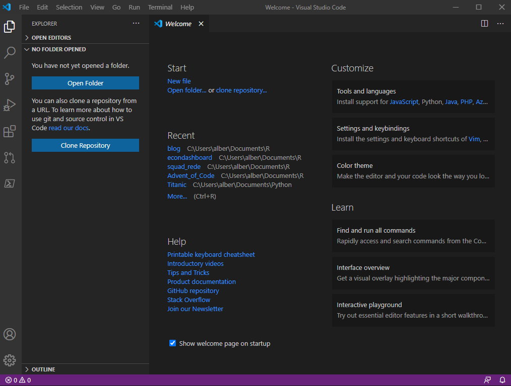
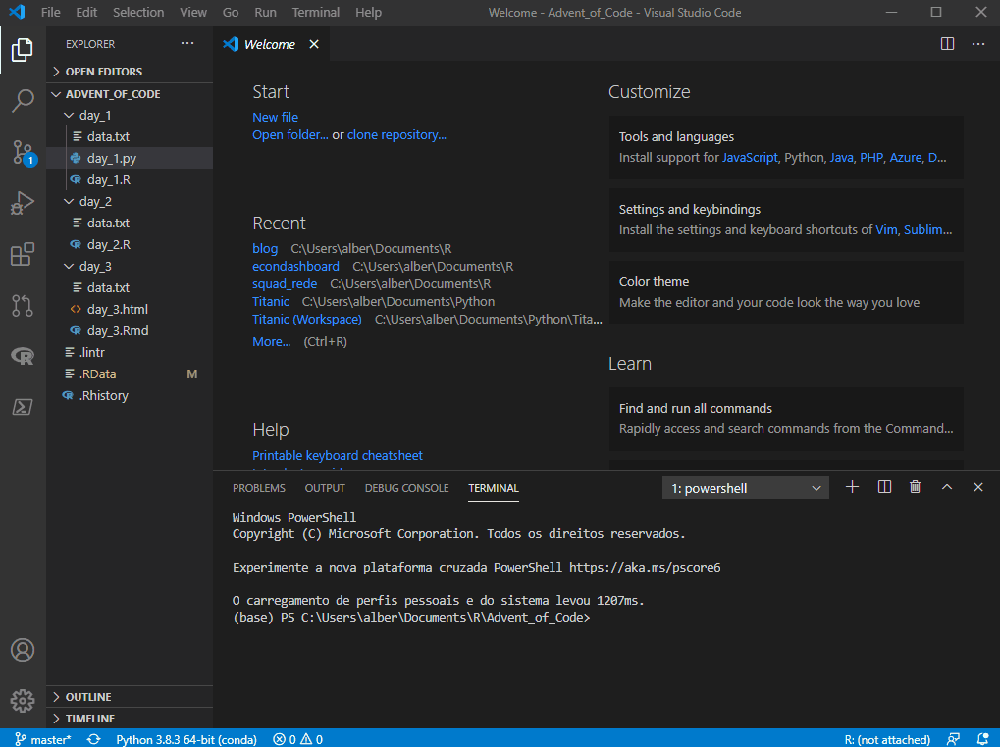

**Hoje eu trabalho exclusivamente no VSCode e sempre que abro o RStudio tenho a sensação de que estou numa IDE do século passado.**

Comecei a usar o VSCode em outubro do ano passado quando comecei a estudar Python. Pesquisando sobre o setup ideal, li que a IDE de menor impacto para usuários de R [@R] seria o Spyder, mas que a experiência de um usuário Python nativo seria com o VSCode, então foi pra lá que eu fui, mesmo sendo uma experiência mais complicada.
{}

Rapidamente me apaixonei por sua capacidade e maturidade. Há extensões da comunidade para tudo, o que torna a experiência muito agradável! Entretanto, o ecossistema do R ainda era muito voltado ao RStudio e eu ainda me via preso naquela IDE no meu dia-a-dia com o R. Claro que isso mudou quando vi esse tweet do [Miles McBain](https://twitter.com/MilesMcBain):
{}

Passando a considerar o VSCode como uma possibilidade real para R, dei uma pesquisada e achei esse [post](https://renkun.me/2019/12/11/writing-r-in-vscode-a-fresh-start/) do [Kun Ren](https://twitter.com/renkun_ken) que oferece um setup para trabalhar em R no VSCode. Neste post falo das funcionalidades e de como configurar.

# QUAL A BOA DO VSCODE?

- Code completion:


Depois de conhecer e trabalhar com todas essas *features*, eu olho para trás e lembro o *fuzuê* que foi quando anunciaram os *rainbow parenthesis* no RStudio - que por sinal ainda está em beta. Eu não consigo entender como a comunidade vibra por tão pouco!

# INSTALAÇÃO

Os softwares necessários são:

1. Visual Studio Code e suas extensões:
- [VSCode](https://code.visualstudio.com/download): a IDE
- [vscode-R](https://marketplace.visualstudio.com/items?itemName=Ikuyadeu.r): extensão para suporte à linguagem R
- [vscode-r-lsp](https://marketplace.visualstudio.com/items?itemName=REditorSupport.r-lsp): R Language Server Protocol Client para VSCode

2. Pacotes:
- [languageserver](https://github.com/REditorSupport/languageserver) [@lsp]: implementação de Language Server Protocol para R
- [httpgd](https://github.com/nx10/httpgd) (recomendado): dispositivo gráfico de servidor http assíncrono para R

3. Python & Radian:
- [Python](https://www.python.org/downloads/)  (recomendado): requisito para instalação do Radian, implementado em Python
- [Radian](https://github.com/randy3k/radian)  (recomendado): console alternativo para R, com edição multilinha e *rich syntax highlighting*

4. [Pandoc](https://pandoc.org/installing.html): conversor universal de documentos, responsável por converter arquivos em R Markdown (.Rmd) para html

# PRIMEIROS PASSOS

Com o VSCode instalado, você verá a tela de boas vindas, que se parece com isso:



A primeira coisa a se notar é que o conceito de projeto (.Rproj) não existe no VSCode. Você tem uma pasta e pronto, todos os caminhos relativos apontam para ela.

Na barra lateral, o *explorer* te dará a opção de abrir uma pasta (um projeto) ou clonar um repositório. Abrindo minha pasta do **Advent of Code 2020**, você verá meus diretórios e arquivos à esquerda. Há códigos em Python e em R. Posso abrí-los e organizá-los da forma que eu quiser. Os terminais ficam logo abaixo e também podem ser movidos para qualquer outra parte.



 As extensões podem ser instaladas pelo menu à esquerda. O próprio VSCode irá recomendar a instalação de extensões quando você abrir algum tipo de arquivo que não tenha interpretador ou *formatter* instalado, por exemplo.

 

 **Importante: não instale a extensão RTools junto com as extensões citadas acima, pois não são complementares e irá causar conflitos.**

Com as extensões instaladas, vamos às configurações. Primeiro, abra a *command palette* com ctrl+shift+p. Através dela você poderá acessar diversos comandos e atalhos no VSCode, como:

- criação de novo terminal (R, Python etc)
- lançar os *RStudio addins*
- compilar arquivos RMarkdown (knit .Rmd)
- acessar configurações e teclas de atalho
- instalar pacotes
- formatar arquivos e MUITOS outros

Acessando as configurações do VSCode, podemos configurar tanto o editor quanto suas extensões:


Aqui estão as que utilizo atualmente. Altere conforme necessário e sua preferência.

```{js}
{
    // VSCode setup
    "terminal.integrated.shell.windows": "C:\\WINDOWS\\System32\\WindowsPowerShell\\v1.0\\powershell.exe",
    "editor.formatOnPaste": true, // recomendado
    "editor.formatOnType": true, // recomendado
    "diffEditor.ignoreTrimWhitespace": false,
    "files.autoSave": "off",

    // Python setup
    "python.pythonPath": "C:\\Users\\alber\\AppData\\Local\\Programs\\anaconda3\\python.exe",
    "jupyter.alwaysTrustNotebooks": true,

    // R setup
    "[r]": { // obrigatório
        "editor.defaultFormatter": "REditorSupport.r-lsp"
    },
    "files.associations": { // obrigatório
        "*.rmd": "markdown",
        "*.Rmd": "rmd"
    },
    "r.sessionWatcher": true, // obrigatório
    "r.bracketedPaste": true, // obrigatório
    "r.rterm.windows": "C:\\Users\\alber\\AppData\\Local\\Programs\\anaconda3\\Scripts\\radian.exe", // caso tenha instalado o Radian
    "r.rpath.windows": "C:\\Program Files\\R\\R-4.0.3\\bin\\R.exe", // obrigatório
    "r.lsp.debug": true, // obrigatório
    "r.alwaysUseActiveTerminal": true, // obrigatório
    "r.rtermSendDelay": 0,
}
```

Também são necessárias algumas configurações no .Rprofile:

```{r, eval = FALSE}

# opções
options(
  # permitir RStudio Addins no VSCode
  vsc.rstudioapi = TRUE,
  # alterar o schema de highlight no console Radian
  radian.color_scheme = "native",
  # adicionar code completion após $
  languageserver.server_capabilities = list(
    signatureHelpProvider = list(triggerCharacters = list("(", ",", "$")),
    completionProvider = list(
      resolveProvider = TRUE, triggerCharacters = list(".", ":", "$")
    )
  )
)

# gráficos interativos no VSCode com o {httpgd}
if (interactive() && Sys.getenv("TERM_PROGRAM") == "vscode") {
  if ("httpgd" %in% .packages(all.available = TRUE)) {
    options(vsc.plot = FALSE)
    options(device = function(...) {
      httpgd::httpgd()
      .vsc.browser(httpgd::httpgdURL(), viewer = "Beside")
    })
  }
}
```

**Importante: não instalar o {httpgd} ou deixar de incluir essa configuração no .Rprofile vai fazer com que seus gráficos sejam plotados numa janela com tamanho fixo, sem a possibilidade de manuipular o tamanho do plot interativamente.**


# REFERÊNCIAS