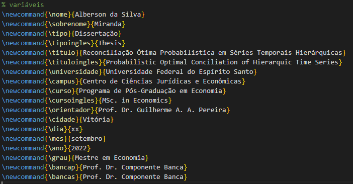
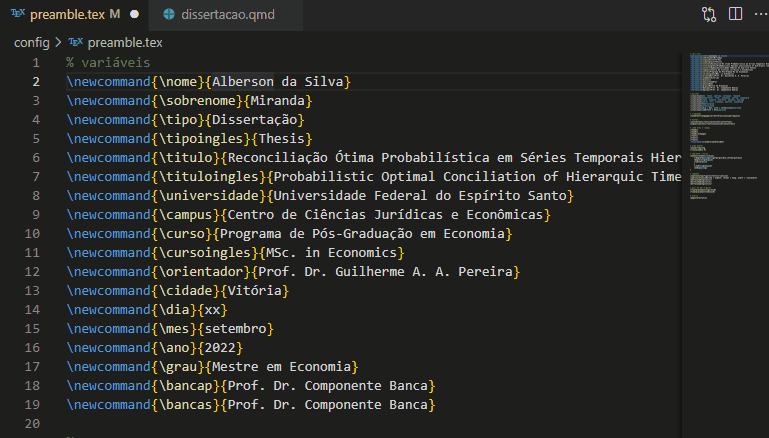

Aproveitando que começo a escrever [minha dissertação](https://github.com/albersonmiranda/dissertacao/blob/master/dissertacao.pdf) este semestre, porque não matar dois coelhos com uma cajadada só (Luisa Mell me perdoa) e conhecer esse tal de [Quarto](https://quarto.org/) que está na boca do povo? Pois bem, [aqui está um template](https://github.com/albersonmiranda/dissertacao) para monografia/dissertação/tese em Quarto^[Esse template é uma adaptação do [modelo padrão da UEL](http://www.uel.br/projetos/experimental/pages/modelo-monografiauel.php).].

Para facilitar (ou não, o futuro dirá) a vida do povo, parametrizei os elementos pré-textuais — capa, folha de rosto, folha de aprovação, resumo, abstract etc. São esses aqui:

Para usar, primeiramente os pré-requisitos:

1. [Instalar o Quarto](https://quarto.org/docs/get-started/);
2. Instalar uma distribuição Tex (porque estamos falando de geração de PDF) ^[Para usuários de R, o mais fácil é via `tinytex::install_tinytex()`.];
3. Como, obviamente, estou usando o VSCode, instalar a [extensão do Quarto](https://marketplace.visualstudio.com/items?itemName=quarto.quarto).

Agora você pode *forkar* o projeto e cair dentro! Basta atualizar os parâmetros em `config/preamble.tex` e escrever seu trabalho em `dissertacao.qmd`:

# CITAÇÃO

{}
