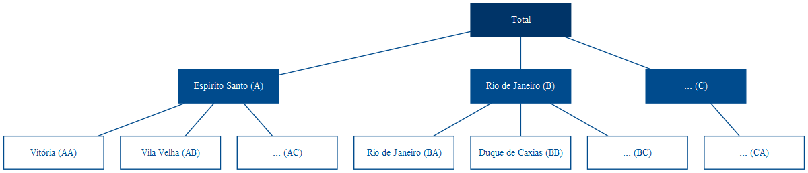
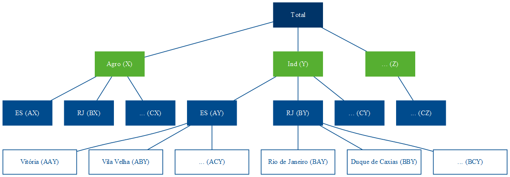
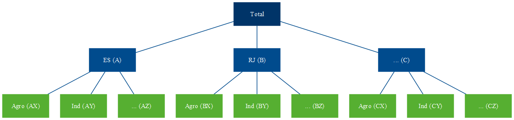

```{r options, include = FALSE}
knitr::opts_chunk$set(
  echo = FALSE,
  fig.cap = FALSE,
  out.width = "100%"
)
```

Já faz quase uma década que chega nessa época do ano e eu trabalho com previsões de séries temporais lá no [Banestes](https://www.banestes.com.br/). Na hora de estabelecer metas e objetivos orçamentários (saldos, receitas, despesas etc), saber modelar e fazer previsões é uma mão na roda.

Claro que sozinhas não devem ser adotadas como finais ou verdadeiras, uma vez que não usam da informação gerencial e expectativas dos *stakeholders*, por exemplo. Mas são um ponto de partida razoável que serve como base para elaborar e construir expectativas, plano de ação etc.

## SÉRIES HIERÁRQUICAS E SÉRIES AGRUPADAS {-}

Séries temporais hierárquicas são aquelas que podem ser agregadas ou desagregadas naturalmente em uma estrutura aninhada [@hyndman2021]. Para ilustrar, tome a série do PIB brasileiro. Ela pode ser desagregada por estado que, por sua vez, pode ser desagregada por município.

```{r h, fig.cap = "Séries Hierárquicas"}

```

Essa estrutura pode ser representada por equações para qualquer nível de agregação.

$$
\begin{align}
y_t &= y_{A,t} + y_{B,t} + y_{C,t} \\
y_t &= y_{AA,t} + y_{AB,t} + y_{AC,t} + y_{BA,t} + y_{BC,t} + y_{CA,t} \\
y_{A,t} &= y_{AA,t} + y_{AB,t} + y_{AC,t}
\end{align}
$$

Assim, o agregado nacional pode ser representado apenas pelos agregados dos estados, através de (1), ou como o agregado dos municípios (2). Já o agregado para o estado do Espírito Santo é representado por (3).

Alternativamente, podemos descrever a estrutura completa de forma matricial:

$$
\begin{bmatrix}
    y_{t} \\
    y_{A, t} \\
    y_{B, t} \\
    y_{C, t} \\
    y_{AA, t} \\
    y_{AB, t} \\
    y_{AC, t} \\
    y_{BA, t} \\
    y_{BB, t} \\
    y_{BC, t} \\
    y_{CA, t}
\end{bmatrix}
=
\begin{bmatrix}
    1 & 1 & 1 & 1 & 1 & 1 & 1 \\
    1 & 1 & 1 & 0 & 0 & 0 & 0 \\
    0 & 0 & 0 & 1 & 1 & 1 & 0 \\
    0 & 0 & 0 & 0 & 0 & 0 & 1 \\
    1 & 0 & 0 & 0 & 0 & 0 & 0 \\
    0 & 1 & 0 & 0 & 0 & 0 & 0 \\
    0 & 0 & 1 & 0 & 0 & 0 & 0 \\
    0 & 0 & 0 & 1 & 0 & 0 & 0 \\
    0 & 0 & 0 & 0 & 1 & 0 & 0 \\
    0 & 0 & 0 & 0 & 0 & 1 & 0 \\
    0 & 0 & 0 & 0 & 0 & 0 & 1 \\
\end{bmatrix}
\begin{bmatrix}
    y_{AA, t} \\
    y_{AB, t} \\
    y_{AC, t} \\
    y_{BA, t} \\
    y_{BB, t} \\
    y_{BC, t} \\
    y_{CA, t}
\end{bmatrix}
$$

Por outro lado, o PIB pode ser também desagregado de forma cruzada de acordo com a atividade econômica --- lavoura, rebanho, indústria de transformação, extrativa, bens de capital, bens intermediários, comércio de vestuário, automotivos, serviços etc. Essa estrutura não pode ser desagregada naturalmente de uma única forma, como é a hierarquia de estados e municípios. Não pode ser aninhada por um atributo como a própria geografia. A esse tipo de estrutura dá-se o nome de séries agrupadas.

```{r agrupadas, fig.cap = "Séries Agrupadas"}

```

Combinando as duas, temos a estrutura de séries hierárquicas agrupadas. Ao contrário da estrutura hierárquica, que só pode ser agregada de uma forma --- como com os municípios abaixo dos estados ---, a adição da estrutura agrupada pode ocorrer tanto acima (Figura \@ref(fig:ha1)) quanto abaixo (Figura \@ref(fig:ha2)) da hierárquica.

```{r ha1, fig.cap = "Séries Hierárquicas Agrupadas (a)"}

```

```{r ha2, fig.cap = "Séries Hierárquicas Agrupadas (b)"}

```

Na notação matricial, a estrutura da Figura \@ref(fig:ha2) é representada como abaixo. Formalmente, o primeiro membro da igualdade é composto pelo vetor $\mathbf{y}_t$ $n$-dimensional com todas as observações no tempo $t$ para todos os níveis da hierarquia. O segundo membro é composto pela matriz de soma $\mathbf{S}$ de dimensão $n \times m$ que define as equações para todo nível de agregação, e pela matriz $\mathbf{b}_t$ composta pelas séries no nível mais desagregado.

\begin{equation}
\mathbf{y}_t=\mathbf{Sb}_t
\end{equation}

\begin{equation}
\begin{bmatrix}
    y_{t} \\
    y_{A, t} \\
    y_{B, t} \\
    y_{C, t} \\
    y_{X, t} \\
    y_{Y, t} \\
    y_{Z, t} \\
    y_{AX, t} \\
    y_{AY, t} \\
    y_{AZ, t} \\
    y_{BX, t} \\
    y_{BY, t} \\
    y_{BZ, t} \\
    y_{CX, t} \\
    y_{CY, t} \\
    y_{CZ, t}
\end{bmatrix}
=
\begin{bmatrix}
    1 & 1 & 1 & 1 & 1 & 1 & 1 & 1 & 1 \\
    1 & 1 & 1 & 0 & 0 & 0 & 0 & 0 & 0 \\
    0 & 0 & 0 & 1 & 1 & 1 & 0 & 0 & 0 \\
    0 & 0 & 0 & 0 & 0 & 0 & 1 & 1 & 1 \\
    1 & 0 & 0 & 1 & 0 & 0 & 1 & 0 & 0 \\
    0 & 1 & 0 & 0 & 1 & 0 & 0 & 1 & 0 \\
    0 & 0 & 1 & 0 & 0 & 1 & 0 & 0 & 1 \\
    1 & 0 & 0 & 0 & 0 & 0 & 0 & 0 & 0 \\
    0 & 1 & 0 & 0 & 0 & 0 & 0 & 0 & 0 \\
    0 & 0 & 1 & 0 & 0 & 0 & 0 & 0 & 0 \\
    0 & 0 & 0 & 1 & 0 & 0 & 0 & 0 & 0 \\
    0 & 0 & 0 & 0 & 1 & 0 & 0 & 0 & 0 \\
    0 & 0 & 0 & 0 & 0 & 1 & 0 & 0 & 0 \\
    0 & 0 & 0 & 0 & 0 & 0 & 1 & 0 & 0 \\
    0 & 0 & 0 & 0 & 0 & 0 & 0 & 1 & 0 \\
    0 & 0 & 0 & 0 & 0 & 0 & 0 & 0 & 1
\end{bmatrix}
\begin{bmatrix}
    y_{AX, t} \\
    y_{AY, t} \\
    y_{AZ, t} \\
    y_{BX, t} \\
    y_{BY, t} \\
    y_{BZ, t} \\
    y_{CX, t} \\
    y_{CY, t} \\
    y_{CZ, t}
\end{bmatrix}
\end{equation}

## ABORDAGENS TOP-DOWN E BOTTOM-UP {-}

Talvez as formas mais intuitivas de se pensar em previsões para esses tipos de estrutura sejam as abordagens top-down e bottom-up. Tome a estrutura descrita na Figura \@ref(fig:h), por exemplo. Podemos realizar a previsão para o horizonte de tempo $h$ do agregado do PIB brasileiro, representado no topo da hierarquia por *Total* (6), e então distribuir os valores previstos proporcionalmente entre os estados e municípios.

\begin{equation}
\hat{y}_{T+h | T} = E[y_{T+h} | \Omega_T]
\end{equation}

Essa é a abordagem top-down. Nela, a previsão para os níveis mais desagregados da hierarquia são determinadas por uma proporção $p_i$ do nível agregado. Por exemplo, as previsões para Vitória são dadas pela equação (7).

\begin{equation}
\tilde{y}_{AA, T+h | T} = p_{1}\hat{y}_{T+h | T}
\end{equation}

Para isso, temos de definir uma matriz com todos esses pesos, que, seguindo a formulação de @hyndman2021, vamos chamar de $\mathbf{G}$:

\begin{equation}
\mathbf{G}
=
\begin{bmatrix}
    p_1 & 0 & 0 & 0 & 0 & 0 & 0 & 0 & 0 & 0 & 0 \\
    p_2 & 0 & 0 & 0 & 0 & 0 & 0 & 0 & 0 & 0 & 0 \\
    p_3 & 0 & 0 & 0 & 0 & 0 & 0 & 0 & 0 & 0 & 0 \\
    p_4 & 0 & 0 & 0 & 0 & 0 & 0 & 0 & 0 & 0 & 0 \\
    p_5 & 0 & 0 & 0 & 0 & 0 & 0 & 0 & 0 & 0 & 0 \\
    p_6 & 0 & 0 & 0 & 0 & 0 & 0 & 0 & 0 & 0 & 0 \\
    p_7 & 0 & 0 & 0 & 0 & 0 & 0 & 0 & 0 & 0 & 0
\end{bmatrix}
\end{equation}

$\mathbf{G}$ é uma matriz $m \times n$ que multiplica a matriz $\hat{\mathbf{y}}_{T+h|T}$ que, por sua vez, é composta pelas previsões base --- as previsões individuais para todos os níveis de agregação. A equação para a abordagem *top-down* será, então:

\begin{equation}
\mathbf{\tilde{y}}_{T+h | T} = \mathbf{SG\hat{y}}_{T+h | T}
\end{equation}

Na notação matricial para a estrutura da Figura \@ref(fig:h), temos:

\begin{equation}
\begin{bmatrix}
    \tilde{y}_{t} \\
    \tilde{y}_{A, t} \\
    \tilde{y}_{B, t} \\
    \tilde{y}_{C, t} \\
    \tilde{y}_{AA, t} \\
    \tilde{y}_{AB, t} \\
    \tilde{y}_{AC, t} \\
    \tilde{y}_{BA, t} \\
    \tilde{y}_{BB, t} \\
    \tilde{y}_{BC, t} \\
    \tilde{y}_{CA, t}
\end{bmatrix}
=
\mathbf{S}
\begin{bmatrix}
    p_1 & 0 & 0 & 0 & 0 & 0 & 0 & 0 & 0 & 0 & 0 \\
    p_2 & 0 & 0 & 0 & 0 & 0 & 0 & 0 & 0 & 0 & 0 \\
    p_3 & 0 & 0 & 0 & 0 & 0 & 0 & 0 & 0 & 0 & 0 \\
    p_4 & 0 & 0 & 0 & 0 & 0 & 0 & 0 & 0 & 0 & 0 \\
    p_5 & 0 & 0 & 0 & 0 & 0 & 0 & 0 & 0 & 0 & 0 \\
    p_6 & 0 & 0 & 0 & 0 & 0 & 0 & 0 & 0 & 0 & 0 \\
    p_7 & 0 & 0 & 0 & 0 & 0 & 0 & 0 & 0 & 0 & 0
\end{bmatrix}
\begin{bmatrix}
    \hat{y}_{T+h|T} \\
    \hat{y}_{A, T+h|T} \\
    \hat{y}_{B, T+h|T} \\
    \hat{y}_{C, T+h|T} \\
    \hat{y}_{AA, T+h|T} \\
    \hat{y}_{AB, T+h|T} \\
    \hat{y}_{AC, T+h|T} \\
    \hat{y}_{BA, T+h|T} \\
    \hat{y}_{BB, T+h|T} \\
    \hat{y}_{BC, T+h|T} \\
    \hat{y}_{CA, T+h|T}
\end{bmatrix}
\end{equation}

O que nos dá uma proporção do total para cada elemento no nível mais desagregado.
\begin{equation}
\begin{bmatrix}
    \tilde{y}_{t} \\
    \tilde{y}_{A, t} \\
    \tilde{y}_{B, t} \\
    \tilde{y}_{C, t} \\
    \tilde{y}_{AA, t} \\
    \tilde{y}_{AB, t} \\
    \tilde{y}_{AC, t} \\
    \tilde{y}_{BA, t} \\
    \tilde{y}_{BB, t} \\
    \tilde{y}_{BC, t} \\
    \tilde{y}_{CA, t}
\end{bmatrix}
=
\mathbf{S}
\begin{bmatrix}
    p_1\hat{y}_{T+h|T} \\
    p_2\hat{y}_{T+h|T} \\
    p_3\hat{y}_{T+h|T} \\
    p_4\hat{y}_{T+h|T} \\
    p_5\hat{y}_{T+h|T} \\
    p_6\hat{y}_{T+h|T} \\
    p_7\hat{y}_{T+h|T}
\end{bmatrix}
\end{equation}

Substituindo a matriz $\mathbf{S}$, temos as equações que definem cada previsão da estrutura em função de proporções da previsão do agregado.

\begin{equation}
\begin{bmatrix}
    \tilde{y}_{t} \\
    \tilde{y}_{A, t} \\
    \tilde{y}_{B, t} \\
    \tilde{y}_{C, t} \\
    \tilde{y}_{AA, t} \\
    \tilde{y}_{AB, t} \\
    \tilde{y}_{AC, t} \\
    \tilde{y}_{BA, t} \\
    \tilde{y}_{BB, t} \\
    \tilde{y}_{BC, t} \\
    \tilde{y}_{CA, t}
\end{bmatrix}
=
\begin{bmatrix}
    1 & 1 & 1 & 1 & 1 & 1 & 1 \\
    1 & 1 & 1 & 0 & 0 & 0 & 0 \\
    0 & 0 & 0 & 1 & 1 & 1 & 0 \\
    0 & 0 & 0 & 0 & 0 & 0 & 1 \\
    1 & 0 & 0 & 0 & 0 & 0 & 0 \\
    0 & 1 & 0 & 0 & 0 & 0 & 0 \\
    0 & 0 & 1 & 0 & 0 & 0 & 0 \\
    0 & 0 & 0 & 1 & 0 & 0 & 0 \\
    0 & 0 & 0 & 0 & 1 & 0 & 0 \\
    0 & 0 & 0 & 0 & 0 & 1 & 0 \\
    0 & 0 & 0 & 0 & 0 & 0 & 1
\end{bmatrix}
\begin{bmatrix}
    p_1\hat{y}_{T+h|T} \\
    p_2\hat{y}_{T+h|T} \\
    p_3\hat{y}_{T+h|T} \\
    p_4\hat{y}_{T+h|T} \\
    p_5\hat{y}_{T+h|T} \\
    p_6\hat{y}_{T+h|T} \\
    p_7\hat{y}_{T+h|T}
\end{bmatrix}
\end{equation}

Já a abordagem bottom-up parte do raciocínio inverso e define as previsões de cada elemento da estrutura a partir das previsões dos elementos mais desagregados. Para tanto, basta modificar a matriz $\mathbf{G}$.

\begin{equation}
\mathbf{G}
=
\begin{bmatrix}
    0 & 0 & 0 & 0 & 1 & 0 & 0 & 0 & 0 & 0 & 0 \\
    0 & 0 & 0 & 0 & 0 & 1 & 0 & 0 & 0 & 0 & 0 \\
    0 & 0 & 0 & 0 & 0 & 0 & 1 & 0 & 0 & 0 & 0 \\
    0 & 0 & 0 & 0 & 0 & 0 & 0 & 1 & 0 & 0 & 0 \\
    0 & 0 & 0 & 0 & 0 & 0 & 0 & 0 & 1 & 0 & 0 \\
    0 & 0 & 0 & 0 & 0 & 0 & 0 & 0 & 0 & 1 & 0 \\
    0 & 0 & 0 & 0 & 0 & 0 & 0 & 0 & 0 & 0 & 1
\end{bmatrix}
\end{equation}

O que resulta nas equações desejadas. Portanto, $\mathbf{G}$ define a abordagem --- se *top-down* ou *bottom-up* ---, e $\mathbf{S}$ define a maneira da qual as previsões são somadas para formar as equações de previsão para cada elemento da estrutura.

\begin{equation}
\begin{bmatrix}
    \tilde{y}_{t} \\
    \tilde{y}_{A, t} \\
    \tilde{y}_{B, t} \\
    \tilde{y}_{C, t} \\
    \tilde{y}_{AA, t} \\
    \tilde{y}_{AB, t} \\
    \tilde{y}_{AC, t} \\
    \tilde{y}_{BA, t} \\
    \tilde{y}_{BB, t} \\
    \tilde{y}_{BC, t} \\
    \tilde{y}_{CA, t}
\end{bmatrix}
=
\begin{bmatrix}
    1 & 1 & 1 & 1 & 1 & 1 & 1 \\
    1 & 1 & 1 & 0 & 0 & 0 & 0 \\
    0 & 0 & 0 & 1 & 1 & 1 & 0 \\
    0 & 0 & 0 & 0 & 0 & 0 & 1 \\
    1 & 0 & 0 & 0 & 0 & 0 & 0 \\
    0 & 1 & 0 & 0 & 0 & 0 & 0 \\
    0 & 0 & 1 & 0 & 0 & 0 & 0 \\
    0 & 0 & 0 & 1 & 0 & 0 & 0 \\
    0 & 0 & 0 & 0 & 1 & 0 & 0 \\
    0 & 0 & 0 & 0 & 0 & 1 & 0 \\
    0 & 0 & 0 & 0 & 0 & 0 & 1
\end{bmatrix}
\begin{bmatrix}
    \hat{y}_{AA, T+h|T} \\
    \hat{y}_{AB, T+h|T} \\
    \hat{y}_{AC, T+h|T} \\
    \hat{y}_{BA, T+h|T} \\
    \hat{y}_{BB, T+h|T} \\
    \hat{y}_{BC, T+h|T} \\
    \hat{y}_{CA, T+h|T}
\end{bmatrix}
\end{equation}

# CITAÇÃO

{}

# REFERÊNCIAS